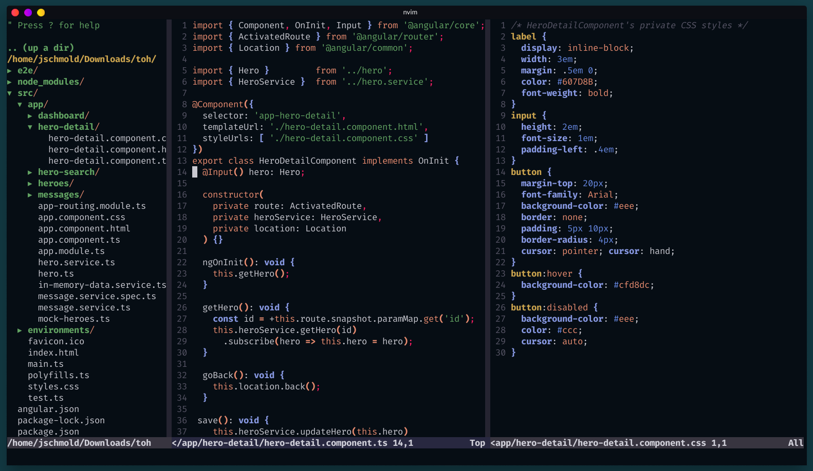

# sweet-dark.vim
A theme inspired from the [KDE Sweet Theme](https://store.kde.org/p/1294174/), forked from [dark-purple.vim](https://github.com/shapeoflambda/dark-purple.vim).

# Credit
Most of this readme and the whole color scheme are the work of [shapeoflambda](https://github.com/shapeoflambda). I only changed the background to match the theme. This readme is also mostly written by him, where inapplicable pieces are removed

# Installation

## Pre-requisites
This is a true color color scheme and a terminal that supports true colors is required. Set `termguicolors` by adding `set termguicolors` in the `.vimrc` file.

## Using Plugin Managers

### Vim Plug
```vim
Plug 'jschmold/sweet-dark.vim'
```

### NeoBundle

```vim
NeoBundle 'jschmold/sweet-dark.vim'
```

## Using the Colorscheme

Add the following lines to the `~/.vimrc`

```vim
syntax enable
colorscheme sweet_dark
```

### Lightline theme
There's also a lightline theme that goes well with this theme. To use it, add the following to your `.vimrc`

```vim
call plug#begin('~/.vim/plugged')

Plug 'jschmold/sweet-dark.vim'
Plug 'itchyny/lightline.vim'

call plug#end()

syntax enable
set termguicolors

" Always show lightline
set laststatus=2
let g:lightline = {
      \ 'colorscheme': 'sweet_dark',
      \ 'active': {
      \   'left': [ [ 'mode', 'paste' ],
      \             ['readonly', 'filename', 'modified' ] ],
      \   'right': [ [ 'lineinfo' ],
      \              [ 'filetype' ],
      \              [ 'gitbranch'] ]
      \ },
      \ 'component_function': {
      \   'gitbranch': 'fugitive#head'
      \ },
      \ }
colorscheme sweet_dark
```

> Make sure lightline is loaded after the theme is loaded.

# Screenshot



| Terminal     | Terminator         |
| --------     | ---------          |
| Font-Regular | Fira code          |
| File/Syntax  | Angular Typescript |
